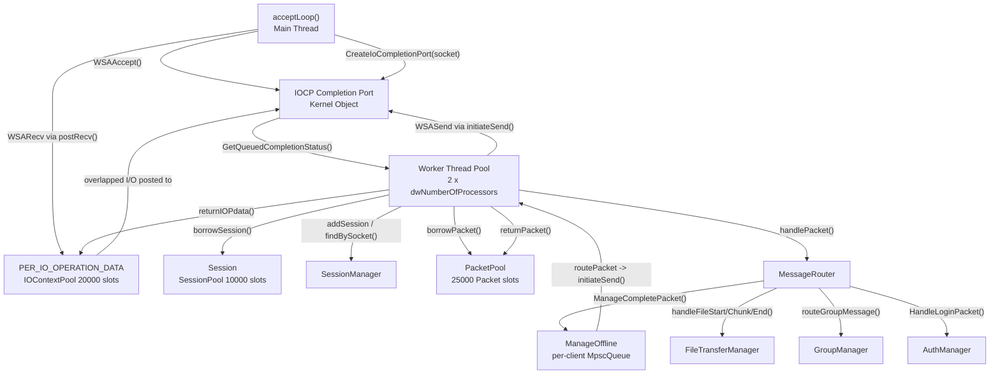
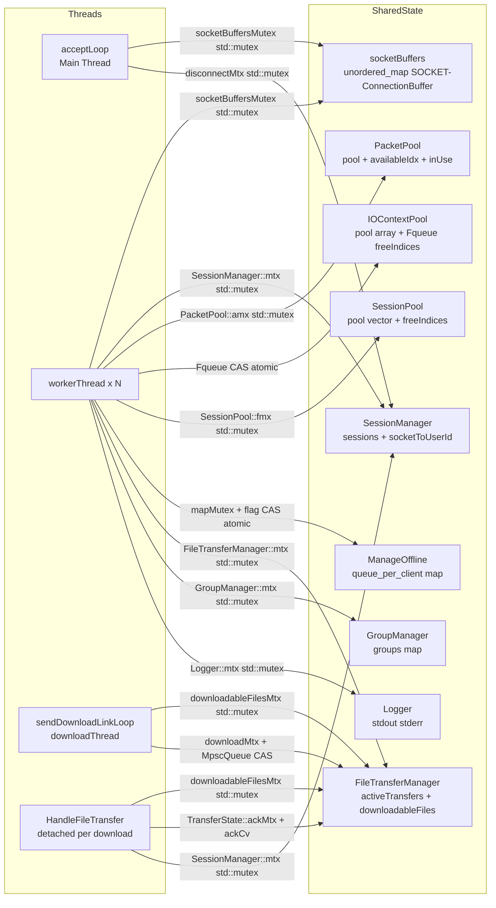
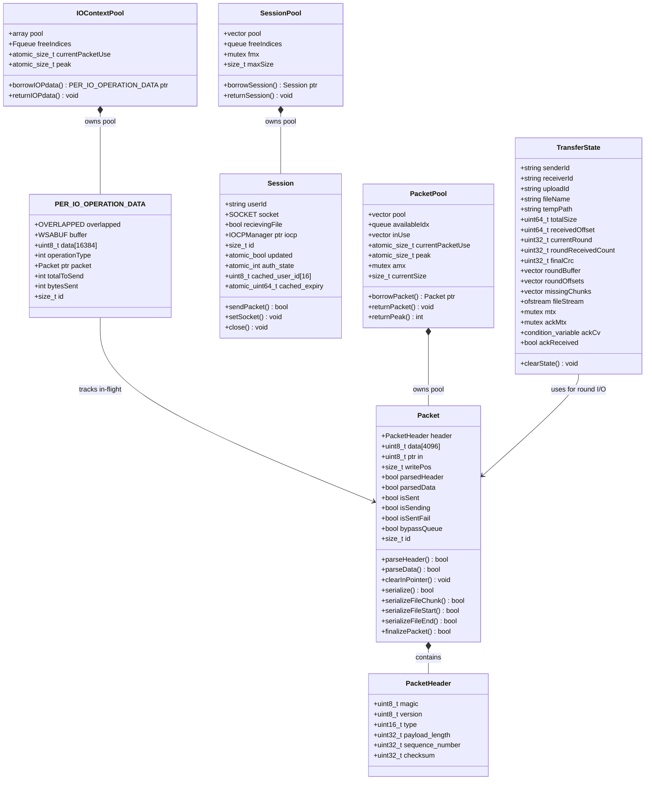
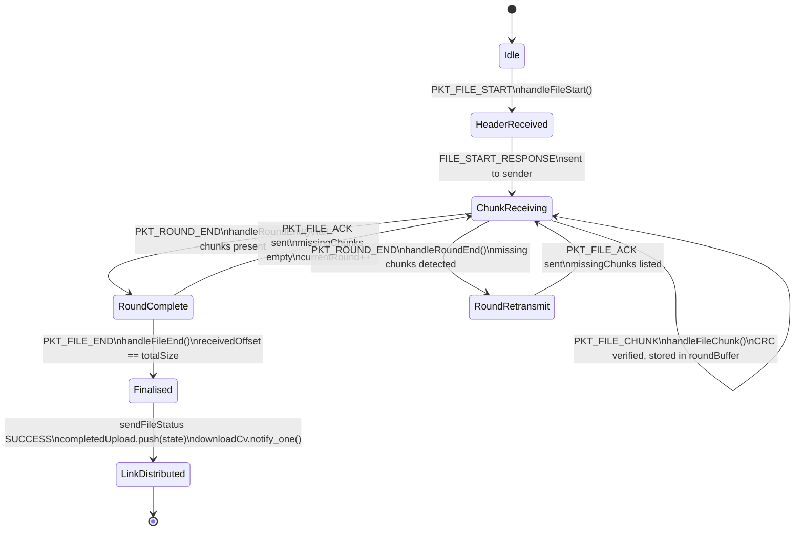
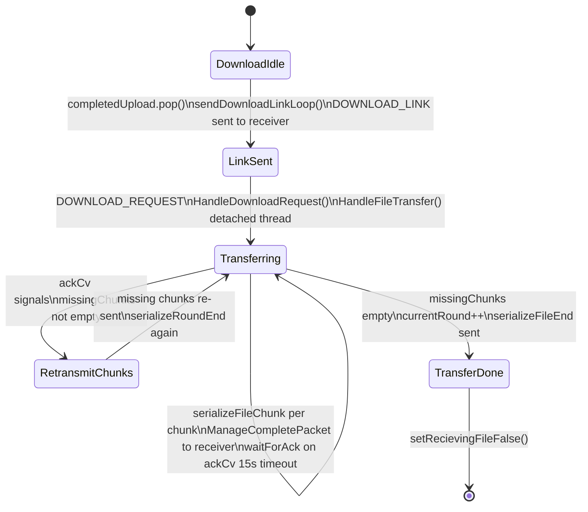
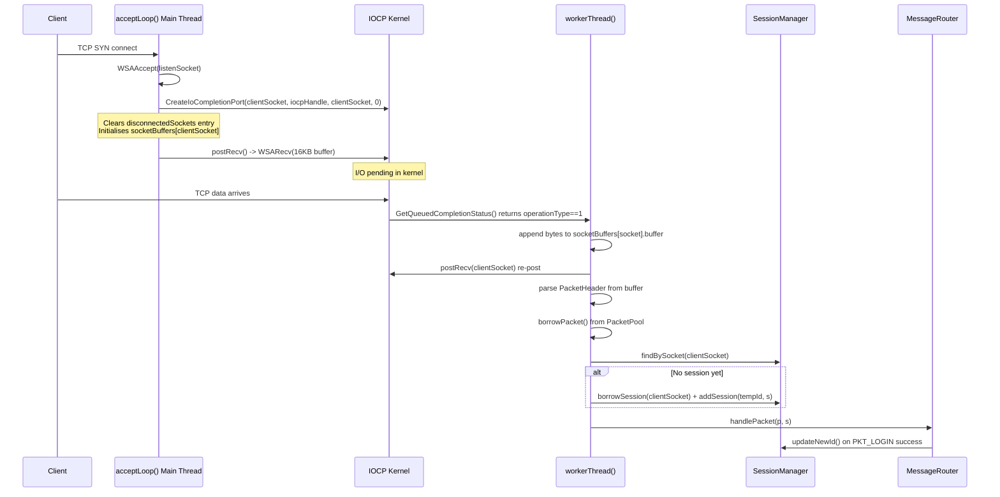
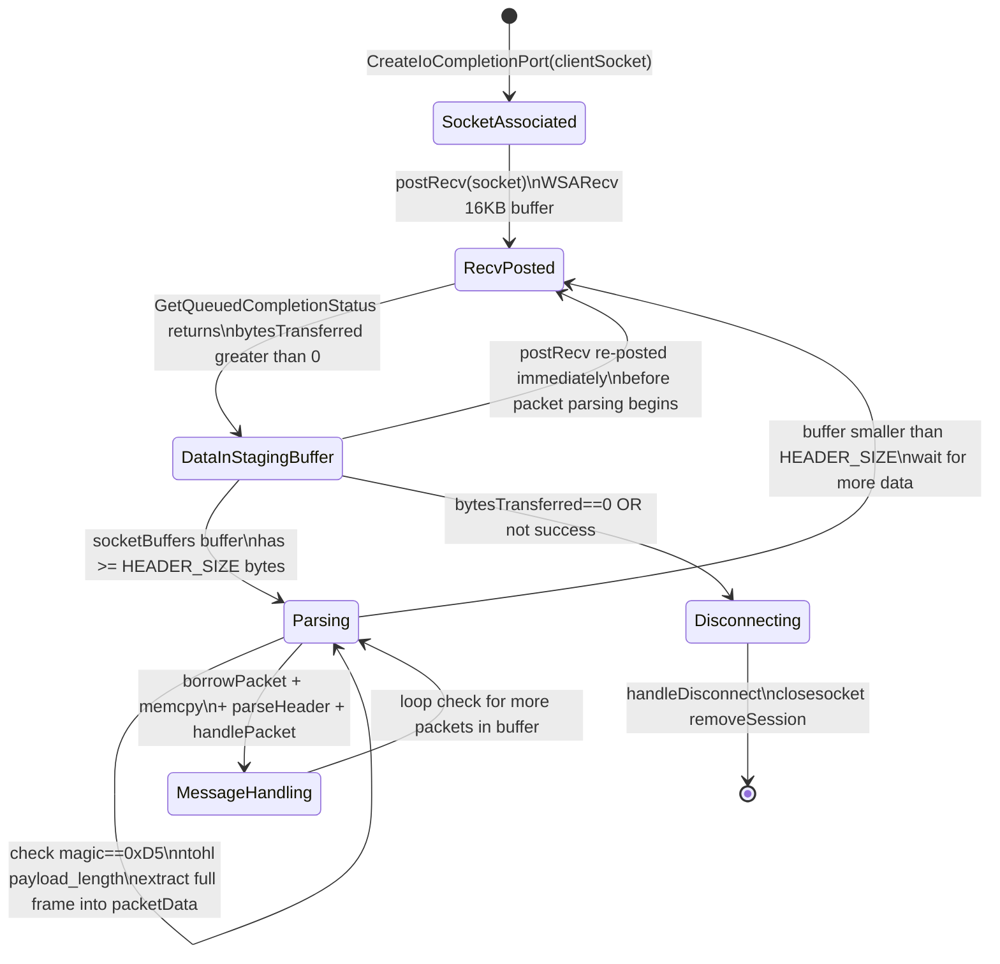
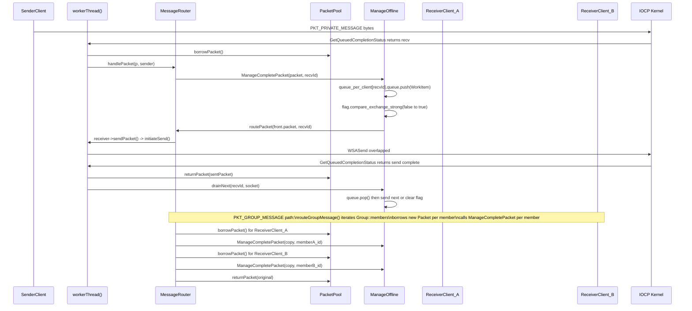

# IOCP Chat Server
## Backend Engineering Internship Report

---

## Title Page

| Field | Value |
|---|---|
| **Project Title** | IOCP Chat Server |
| **CMake Target** | `Server` / `Client` (from `CMakeLists.txt`) |
| **Role** | Backend Engineering Intern |
| **Tech Stack** | C++20 · Windows IOCP · Winsock2 · libsodium · zlib · CMake |
| **Repository** | P1reetam123/IOCP_CHAT_SERVER |
| **Report Date** | August 2026 |

---

## Abstract

This report documents the design, implementation, and engineering challenges of an I/O Completion
Port (IOCP) based multi-client chat server written in C++20 for Windows. The server sustains
1,000–1,500 concurrent client connections with low CPU utilization by dispatching all I/O completions
through the Windows IOCP kernel object to a fixed worker thread pool sized at
`2 × dwNumberOfProcessors` (from `IOCPManager::initialize` in `network/IOCPManager.cpp`). The core
technology stack consists of `Winsock2` (`ws2_32`, `mswsock`) for overlapped TCP I/O, libsodium
for Argon2id password hashing and HMAC-SHA-512/256 session tokens, zlib for CRC-32 checksums in
persistent storage, and `absl::flat_hash_map` for hash-map operations. A fixed-size `PacketPool`
of 25,000 `Packet` objects eliminates per-message heap allocation. Per-client MPSC queues
(`MpscQueue`) and a lock-free in-flight flag (`std::atomic<bool>`) serialise outgoing sends without
a single global bottleneck. A documented race condition in the packet pool's reuse path (borrow flags
not reset on return) was found and fixed under a sustained load test of 1,500 concurrent clients and
approximately 28 million packets with zero delivery failures. The server also implements chunked file
transfer with per-chunk CRC-32C verification, a download-link distribution model, and an offline
message queue with reconnect-triggered drain logic.

---

## 1. Introduction

### 1.1 Purpose

This report provides a formal technical account of a backend engineering internship project: the
design and implementation of a scalable, concurrent chat server on Windows using I/O Completion Ports
as the foundational concurrency mechanism.

### 1.2 Problem Statement

Traditional blocking I/O servers allocate one OS thread per connected client. At C10K scale this
model fails because:

1. **Thread overhead** — each blocked thread consumes a fixed stack (typically 1–8 MB) and requires
   an OS context switch on every I/O event.
2. **Throughput ceiling** — a single consumer thread driving all sends, as the README describes was
   the prior design, "capped the server at ~900 clients" before the per-client queue redesign.
3. **Fragmented wake-up** — `select`/`poll`-based multiplexing requires scanning all descriptors
   on every call, adding O(n) overhead as connection count grows.

Windows IOCP addresses all three failure modes: it provides a kernel-managed completion queue where
threads block on `GetQueuedCompletionStatus` and are woken only when I/O is truly complete, with no
per-connection thread requirement.

### 1.3 Key Objectives

Derived from `README.md` and the observed feature set:

1. Accept and manage 1,000–1,500 concurrent TCP connections using IOCP-native dispatch.
2. Implement per-client MPSC send queues to remove the single-consumer throughput ceiling.
3. Provide a complete authentication stack: Argon2id password hashing, HMAC-SHA-512/256 access
   tokens, refresh-token rotation with reuse detection, email OTP verification.
4. Support 1-to-1 and group chat message routing through `MessageRouter` and `GroupManager`.
5. Implement chunked file upload (client → server) and download (server → client) with CRC-32C
   per-chunk integrity verification and round-based selective retransmission.
6. Deliver offline messages through per-receiver in-memory queues with reconnect-triggered drain.
7. Avoid per-message heap allocation via `PacketPool`, `SessionPool`, and `IOContextPool`.

---

## 2. Technology Stack and Core Concepts

### 2.1 Technology Stack

| Component | Technology | Source Reference |
|---|---|---|
| Language standard | C++20 | `CMakeLists.txt` line 4 |
| Build system | CMake ≥ 3.15 | `CMakeLists.txt` line 1 |
| Async I/O API | Windows IOCP, Winsock2 | `network/IOCPManager.cpp` |
| Network libraries | `ws2_32`, `mswsock` | `CMakeLists.txt` lines 44–45 |
| Cryptography | libsodium (`PkgConfig::SODIUM`) | `CMakeLists.txt` line 47; `auth_types.h` |
| Compression / CRC | zlib (`ZLIB::ZLIB`) | `CMakeLists.txt` line 46; `datastructure/table.h` |
| Hash map | `absl::flat_hash_map` | `CMakeLists.txt` line 48 |
| Packet integrity | CRC-32C (custom) | `protocol/CRC32C.h`, `protocol/CRC32C.cpp` |
| Password hashing | Argon2id via `crypto_pwhash` | `authentication/auth_types.h` |
| Token signing | HMAC-SHA-512/256 via `crypto_auth` | `authentication/auth_types.h` |
| Persistent storage | Memory-mapped file + zlib CRC | `datastructure/table.h` |

### 2.2 What Is IOCP?

Windows I/O Completion Ports are a kernel mechanism for scalable asynchronous I/O. The lifecycle
in this codebase is:

1. **Port creation** — `CreateIoCompletionPort(INVALID_HANDLE_VALUE, NULL, 0, 0)` creates a new
   completion port (`IOCPManager.cpp` line 76). The fourth parameter `0` instructs Windows to set
   the concurrent thread limit equal to the number of processors.

2. **Socket association** — `CreateIoCompletionPort((HANDLE)clientSocket, iocpHandle,
   (ULONG_PTR)clientSocket, 0)` binds every accepted socket to the port (`IOCPManager.cpp` line
   125). The completion key is set to `clientSocket` so worker threads can identify the source of
   each completion without a hashtable lookup.

3. **Overlapped I/O posting** — `WSARecv` and `WSASend` are called with a pointer to a
   `PER_IO_OPERATION_DATA` struct (which begins with an `OVERLAPPED` member), requesting async
   completion. If the I/O cannot complete immediately, `WSA_IO_PENDING` is returned and the
   operation is queued in the kernel.

4. **Completion dequeue** — each worker thread calls `GetQueuedCompletionStatus(iocpHandle, ...)`
   in an infinite loop (`IOCPManager.cpp` line 163). When an operation completes, the thread
   receives `bytesTransferred`, the completion key (the `SOCKET`), and a pointer to the
   `PER_IO_OPERATION_DATA` that was submitted.

5. **Completion semantics** — the data is already in the user-space buffer when `GQCS` returns;
   there is no need to call `recv` again. The worker immediately reads from `pData->data` and
   processes the bytes.

6. **Shutdown signal** — `PostQueuedCompletionStatus(iocpHandle, 0, 0, nullptr)` is called once
   per worker thread in `IOCPManager::shutdown` (line 532) to unblock each thread and cause it to
   exit.

### 2.3 IOCP vs. Competing Models

| Model | Scalability | Notification Semantics | Platform |
|---|---|---|---|
| Blocking per-thread | O(n) threads, stack memory bound | Synchronous; thread blocks in `recv` | Portable |
| `select`/`poll` | O(n) descriptor scan per call | Readiness; data may still need copying | POSIX / Windows |
| `epoll` (Linux) | O(1) per event | Readiness notification only | Linux |
| Windows IOCP | O(1) per event; bounded thread pool | Completion: data already in buffer | Windows |

IOCP's key advantage over `epoll` is **completion semantics**: the buffer is populated by the
kernel before the application is notified, removing the need for a second system call to read the
data.

---

## 3. System Architecture and Design

### 3.1 High-Level Architecture



### 3.2 Thread Pool

The thread pool size is computed at runtime from the host processor count (`IOCPManager.cpp`
lines 85–89):

```cpp
SYSTEM_INFO sysInfo;
GetSystemInfo(&sysInfo);
numWorkerThreads = static_cast<int>(sysInfo.dwNumberOfProcessors * 2);
if (numWorkerThreads < 2)
    numWorkerThreads = 2;
```

All threads run `IOCPManager::workerThread()`, blocking on `GetQueuedCompletionStatus`. The thread
pool and synchronization map are shown in Section 4.5.



### 3.3 Per-Client Context Structure



**Field roles in the IOCP pipeline:**

- `PER_IO_OPERATION_DATA::overlapped` — must be the first field so the IOCP kernel can cast the
  `LPOVERLAPPED` pointer back to the full struct.
- `PER_IO_OPERATION_DATA::data[16384]` — 16 KB receive staging buffer; data is appended into
  the per-socket `ConnectionBuffer` after each `GQCS` return.
- `PER_IO_OPERATION_DATA::operationType` — `1` = recv, `0` = send; used in the `workerThread`
  dispatch branch (`IOCPManager.cpp` line 195).
- `PER_IO_OPERATION_DATA::bytesSent` / `totalToSend` — track partial send progress; if
  `bytesSent < totalToSend`, the worker re-posts `WSASend` for the remaining bytes
  (`IOCPManager.cpp` lines 344–370).
- `Packet::isSending` / `isSent` / `isSentFail` — lifecycle flags preventing double-return to pool.
- `Packet::bypassQueue` — when `true`, the packet is returned directly to `PacketPool` instead of
  being routed through `ManageOffline` (used for login-response packets, `MessageRouter.cpp` line
  105).
- `Session::auth_state` — `atomic<int>` read lock-free in `AuthManager::ValidateSessionHotPath`
  on every inbound packet.
- `Session::cached_expiry` — `atomic<uint64_t>` compared against `time()` in the hot-path
  validator; no mutex, no crypto on the common receive path.

### 3.4 SessionManager

`SessionManager` (`session/SessionManager.h`, `.cpp`) owns two `std::unordered_map` containers:

- `sessions`: `std::string` (userId) → `Session*`
- `socketToUserId`: `SOCKET` → `std::string`

A single `std::mutex mtx` protects both maps for every public method: `addSession`,
`removeSession`, `findSession`, `findBySocket`, `getUserIdBySocket`, `setRecievingFileTrue`,
`setRecievingFileFalse`, and `updateNewId`. There is no split-lock pattern; the single mutex
ensures consistency across the two maps at the cost of coarser granularity.

`updateNewId` handles the session upgrade that occurs when a client authenticates:

1. Acquires `mtx`.
2. Checks whether the new userId already has a session on a *different* socket (stale login from
   another device). If so, calls `HandleDisconnectWithoutLock` on that socket and returns the old
   `Session*` to `SessionPool`.
3. Erases the temporary pre-login userId entry.
4. Inserts the canonical userId → session mapping.
5. Stores `true` to `Session::updated` with `memory_order_release` to signal completion.

### 3.5 PacketPool

`PacketPool` (`pool/PacketPool.h`, `.cpp`) is a singleton pre-allocated pool of 25,000 `Packet`
objects stored in a `std::vector<Packet>`. The pool uses:

- `std::queue<size_t> availableIdx` — FIFO index queue of free slots.
- `std::vector<uint8_t> inUse` — one byte per slot; `1` = borrowed, `0` = available.
- `std::mutex amx` — guards both `availableIdx` and `inUse`.
- `std::atomic<size_t> currentPacketUse` and `peak` — track live usage for diagnostics.

**Borrow path (`borrowPacket`):** holds `amx`, pops from `availableIdx`, double-checks
`inUse[id]`, sets `inUse[id] = 1`, releases lock, returns `&pool[id]`.

**Return path (`returnPacket`):** calls `p->clearInPointer()` (resets all boolean flags and
`writePos`), `memset`s the first 4096 bytes of `data` to zero, then acquires `amx`, pushes `id`
back into `availableIdx`, sets `inUse[id] = 0`.

The documented race condition (README line 10, `IOCPManager.cpp` line 376 comment
"Bug 1: use-after-free fix") was caused by reading `sentPacket->bypassQueue` *after* calling
`PacketPool::Instance().returnPacket(sentPacket)`. The fix saves `bypassQ` to a local variable
before calling `returnPacket`.

### 3.6 File Transfer Subsystem





`TransferState` (`filetransfer/FileTransferManager.h`) holds all transfer state. Key fields:
`uploadId`, `senderId`, `receiverId`, `totalSize`, `receivedOffset`, `currentRound`,
`roundBuffer` (a `vector<vector<uint8_t>>` of `MAX_CHUNKS_PER_ROUND = 1024` slots),
`roundOffsets`, `missingChunks`, and `ofstream fileStream` for disk writes. A per-`TransferState`
`std::mutex mtx` serialises chunk insertion and round-end processing. A separate `ackMtx` and
`ackCv` condition variable implement the ACK timeout used by `HandleFileTransfer`.

The **upload path** is fully driven by IOCP worker threads through `handleFileChunk`,
`handleRoundEnd`, and `handleFileEnd`. The **download path** uses a detached thread
(`HandleFileTransfer` launched via `std::thread::detach` in `FIleDownload.cpp` line 132), which
blocks on `ackCv.wait_for` with a 15-second timeout waiting for `PKT_FILE_ACK` packets delivered
by a worker thread through `onAckReceived`.

---

## 4. Implementation Details

### 4.1 Connection Acceptance Workflow



### 4.2 Asynchronous Receive Workflow



The server does **not** use a zero-byte receive pattern. Each `postRecv` call posts a full 16 KB
`WSARecv` directly into `PER_IO_OPERATION_DATA::data`. Received bytes are appended into a
per-socket `std::vector<char>` staging buffer (`socketBuffers[socket].buffer`) protected by
`IOCPManager::socketBuffersMutex`. The `postRecv` call is re-issued immediately after the append
— before packet parsing — to minimise the window where the kernel has no pending receive on the
socket. The vector's `erase` from the front (after consuming a complete packet) is noted in a
comment in `IOCPManager.cpp` line 274 as "also slow", indicating a known performance debt item.

### 4.3 Message Parsing and Protocol Framing

The wire format is defined in `protocol/PacketHeader.h` and `protocol/ProtocolStructs.h`:

**`PacketHeader`** (16 bytes, `#pragma pack(push, 1)`):

| Field | Type | Size | Description |
|---|---|---|---|
| `magic` | `uint8_t` | 1 | Always `0xD5` (`START_BYTE`) |
| `version` | `uint8_t` | 1 | Always `0x01` (`CURRENT_VERSION`) |
| `type` | `uint16_t` | 2 | `PacketType` enum, network byte order |
| `payload_length` | `uint32_t` | 4 | Payload size in bytes, network byte order |
| `sequence_number` | `uint32_t` | 4 | Sequence number, currently always 0 |
| `checksum` | `uint32_t` | 4 | CRC-32C over header (excluding checksum) and payload |

Frame parsing in `IOCPManager::workerThread` (`IOCPManager.cpp` lines 239–274):

1. Check `recvBuffer.size() >= HEADER_SIZE`.
2. Cast buffer start to `PacketHeader*`, check `hdr->magic == START_BYTE`.
3. `payloadSize = ntohl(hdr->payload_length)`.
4. Check `recvBuffer.size() >= HEADER_SIZE + payloadSize`.
5. Check `payloadSize <= sizeof(Packet::data)` (overflow guard).
6. Copy full frame into `packetData`, erase consumed bytes from buffer.

`Packet::parseHeader` (`protocol/Packet.cpp`) converts all multi-byte fields from network to host
byte order and stores them in `Packet::header`. `Packet::parseData` verifies the CRC-32C checksum
over header (excluding the checksum field) and payload. The README notes (line 28) that
`Packet::parseData()` is actively being hardened against parsing edge cases.

Payload structs (`ProtocolStructs.h`) are also `#pragma pack(push, 1)`. For example,
`ChatMessagePayload` carries `sender_id[16]`, `receiver_id[16]`, `uint64_t timestamp`,
`uint32_t message_number`, `uint16_t username_len`, `uint16_t text_len`, followed immediately
by the username and text bytes.

### 4.4 Broadcast Mechanism



**Send serialisation via `ManageOffline`:** Each receiver has a `clientQueue` containing a
`MpscQueue<WorkItem>` (a lock-free multi-producer single-consumer queue, `datastructure/Mpsc.h`)
and an `std::atomic<bool> flag` serving as the in-flight indicator. `ManageCompletePacket` pushes
to the MPSC queue, then attempts a `compare_exchange_strong(false → true)` on `flag`. Only the
thread that wins this CAS initiates the first `routePacket` call. All subsequent packets are
handled by `drainNext` called from the send completion handler, ensuring FIFO delivery per receiver
with no concurrent sends.

The `mapMutex` in `ManageOffline` protects only the `unordered_map::operator[]` call (which can
cause a rehash) — not the `MpscQueue` itself, which is independently lock-free.

### 4.5 Synchronization Matrix

| Shared Resource | File | Protecting Threads | Synchronization Mechanism | Critical Section |
|---|---|---|---|---|
| `socketBuffers` recv staging | `IOCPManager.cpp` | `acceptLoop`, all `workerThread` | `socketBuffersMutex` static `std::mutex` | Append received bytes; erase consumed bytes; erase on disconnect |
| `disconnectedSockets` | `IOCPManager.cpp` | all `workerThread`, `acceptLoop` | `disconnectMtx` `std::mutex` | One-shot disconnect guard; prevents double `closesocket` |
| `SessionManager::sessions` + `socketToUserId` | `session/SessionManager.cpp` | all `workerThread`, `acceptLoop` | `SessionManager::mtx` `std::mutex` | Insert, lookup, remove, and upgrade session entries |
| `PacketPool::pool` / `availableIdx` / `inUse` | `pool/PacketPool.cpp` | all `workerThread`, download threads | `PacketPool::amx` `std::mutex` | Borrow and return packet slots |
| `IOContextPool::freeIndices` | `pool/IOContextPool.h` | all `workerThread` | `Fqueue` CAS `std::atomic<size_t>` head/tail | Borrow and return `PER_IO_OPERATION_DATA` slots |
| `SessionPool::pool` / `freeIndices` | `pool/SessionPool.cpp` | all `workerThread` | `SessionPool::fmx` `std::mutex` | Borrow and return `Session` slots |
| `ManageOffline::queue_per_client` map | `offlineManager/ManageOffline.cpp` | all `workerThread` | `ManageOffline::mapMutex` `std::mutex` | `unordered_map::operator[]` rehash guard only |
| `ManageOffline::clientQueue::flag` | `offlineManager/ManageOffline.cpp` | multiple `workerThread` | `std::atomic<bool>` CAS `compare_exchange_strong` | In-flight slot ownership; prevents concurrent sends |
| `ManageOffline::clientQueue::queue` | `offlineManager/ManageOffline.cpp` | multiple producers, one consumer | `MpscQueue` lock-free atomic `head`/`tail` | Push from any worker; pop only from CAS winner |
| `FileTransferManager::activeTransfers` / `uploadIdToTransferState` | `filetransfer/FileTransferManager.cpp` | all `workerThread` | `FileTransferManager::mtx` `std::mutex` | Insert/erase/lookup by upload ID |
| `FileTransferManager::downloadableFiles` | `filetransfer/FIleDownload.cpp` | `workerThread`, `downloadThread`, `FTThread` | `downloadableFilesMtx` `std::mutex` | Insert/lookup by upload ID for download state |
| `FileTransferManager::completedUpload` | `filetransfer/FileTransferManager.cpp` | `workerThread` push, `downloadThread` pop | `downloadMtx` + `downloadCv` + `MpscQueue` CAS | Upload-complete notification to download link loop |
| `TransferState::roundBuffer` / `roundReceivedCount` | `filetransfer/FileTransferManager.cpp` | `workerThread`, `FTThread` | `TransferState::mtx` `std::mutex` per transfer | Chunk insertion and round-end evaluation |
| `TransferState::ackReceived` / `missingChunks` | `filetransfer/FIleDownload.cpp` | `workerThread` ACK handler, `FTThread` | `TransferState::ackMtx` + `TransferState::ackCv` | ACK signaling between worker and download thread |
| `GroupManager::groups` | `chat/GroupManager.h` | all `workerThread` | `GroupManager::mtx` `std::mutex` | Create, join, leave, and iterate group membership |
| `UserStore::records_` / `email_to_uid_` | `authentication/auth_store.h` | auth worker threads | `std::shared_mutex mutex_` | Shared lock for lookup; exclusive for insert/update |
| `RefreshFamilyStore::families_` | `authentication/auth_store.h` | auth worker threads | `std::shared_mutex mutex_` | Token family insert, lookup, advance, revoke |
| `Logger` stdout/stderr | `utils/Logger.h` | all threads | `Logger::mtx` static `std::mutex` | `std::cout` / `std::cerr` write |
| `Session::auth_state`, `cached_expiry` | `authentication/AuthManager.h` | `workerThread` read, auth handler write | `std::atomic<int>` / `std::atomic<uint64_t>` acquire/release | Per-packet auth check without any lock |

---

## 5. Challenges and Solutions

### 5.1 Buffer Management — Front-Erase on `std::vector`

**Root Cause** (`IOCPManager.cpp` lines 210–274): Received bytes accumulate in
`ConnectionBuffer::buffer` (`std::vector<char>`). After consuming a complete packet, consumed bytes
are removed with `recvBuffer.erase(recvBuffer.begin(), recvBuffer.begin() + packetSize)`.

**Observable Symptom**: `erase` from the front of a `std::vector` is O(n) — it shifts all
remaining bytes left. Under high throughput with many small packets, this becomes the dominant
latency source.

**Solution**: A comment in `IOCPManager.cpp` line 208 reads "this is slow create a circular buffer
data structure". Line 274 also states "Remove consumed packet bytes this is also slow." The
current code works correctly but the per-erase copy cost is acknowledged engineering debt.

**Verification**: The server operates correctly — framing is intact — but no circular-buffer
replacement has been committed. This is an acknowledged open performance item.

---

### 5.2 SessionManager Concurrency — Dual-Map Consistency

**Root Cause** (`session/SessionManager.cpp`): Two maps (`sessions` and `socketToUserId`) must
remain consistent. Any window where only one is updated while the other is not exposes races under
concurrent disconnect and login.

**Observable Symptom**: A client re-logging in from a new socket while a stale session is still
in `sessions` could result in two active `Session*` pointers to different sockets both claiming
the same userId.

**Solution**: A single `std::mutex mtx` guards all operations that touch both maps atomically.
The `updateNewId` method acquires the lock for the entire upgrade sequence: old-socket disconnect,
old-session return to pool, old-entry erase, new-entry insert (`SessionManager.cpp` lines 6–36).

**Verification**: The `Session::updated` atomic flag (stored with `memory_order_release`) lets the
caller confirm the upgrade committed before further operations proceed.

---

### 5.3 PacketPool Lifecycle Flag Reset — Use-After-Free on Send Completion

**Root Cause** (`network/IOCPManager.cpp`, send completion handler, lines 375–387): In the
original code, `sentPacket->bypassQueue` was read *after*
`PacketPool::Instance().returnPacket(sentPacket)`. Since `returnPacket` releases the slot
(sets `inUse[id] = 0`), another thread could immediately borrow that slot and overwrite
`bypassQueue` before the first thread reads it.

**Observable Symptom** (README line 10): Incorrect `bypassQueue` reads caused wrong branching in
the `drainNext` path — packets that should have been returned were erroneously handed to
`offlineManager` and vice versa. Under 1,500 concurrent clients and ~28M packets this produced
delivery failures.

**Solution**: The fix saves `bool bypassQ = sentPacket->bypassQueue` to a stack-local before
calling `returnPacket`. The comment in `IOCPManager.cpp` line 376 reads
"Bug 1: use-after-free fix."

**Verification**: README line 10: "Fix validated under sustained load — 1500 concurrent clients,
approx. 28M packets, zero delivery failures."

---

### 5.4 Partial Send Handling

**Root Cause** (`IOCPManager.cpp` lines 344–370): `WSASend` is not guaranteed to transmit all
requested bytes in a single completion. If `pData->bytesSent < pData->totalToSend`, the remaining
bytes must be re-submitted.

**Observable Symptom**: Without the partial-send loop, large packets would be silently truncated,
corrupting the framing for all subsequent packets on that connection.

**Solution**: The send completion handler checks `pData->bytesSent < pData->totalToSend`. If true,
it advances `pData->buffer.buf` by `bytesSent`, sets `buffer.len` to the remaining byte count,
and re-posts `WSASend` with the same `pData` (the `OVERLAPPED` is zeroed with `ZeroMemory`
first). The `pData` struct is intentionally not returned to the pool until the final completion.

**Verification**: Any load test including packets larger than a single MTU would exercise this
path. The defensive check is structurally present in the code.

---

### 5.5 Thread Synchronization in File Transfer — Download ACK Timeout

**Root Cause** (`filetransfer/FIleDownload.cpp`, `HandleFileTransfer`, lines 222–231): The
download sender thread calls `state->ackCv.wait_for(lk, std::chrono::seconds(15), ...)` waiting
for `PKT_FILE_ACK` delivered by an IOCP worker through `onAckReceived`. The `onAckReceived`
function acquires `downloadableFilesMtx` to look up the state pointer. If the download thread
holds `downloadableFilesMtx` at the same time (during state lookup at the start of its round
loop), the ACK delivery is blocked and may cause a spurious timeout.

**Observable Symptom**: The 15-second timeout fires and `HandleFileTransfer` logs
"download ACK timeout" and returns, abandoning the transfer mid-way. The diagnostic
`std::cout` lines ("entering into the lock donmtx", "entered into the mtx") in
`FIleDownload.cpp` lines 289–291 reflect investigation of this contention.

**Solution**: The state pointer is looked up once under `downloadableFilesMtx` at the start of
each iteration and stored in a local variable, so the download thread does not hold the map lock
during the blocking `wait_for`. The ACK is signalled through `state->ackCv.notify_one()` after
writing to `state->missingChunks` and setting `state->ackReceived = true` under `state->ackMtx`.

**Verification**: The 15-second timeout serves as the safety net; correct ACK delivery resumes
the loop without hitting it.

---

### 5.6 Double-Disconnect Guard — Concurrent Completion Failures

**Root Cause** (`IOCPManager.cpp`, `handleDisconnect`): When a client disconnects abruptly,
multiple pending overlapped operations (e.g., one recv and one send) may all fail and trigger
their completion events nearly simultaneously. Without a guard, `closesocket` and
`removeSession` could be called multiple times on the same socket from different worker threads.

**Observable Symptom**: Double `closesocket` causes Windows socket errors. Double
`removeSession` on the same userId would attempt to return the same `Session*` to `SessionPool`
twice, corrupting the pool's free index queue.

**Solution**: `IOCPManager::disconnectedSockets` (`std::unordered_set<SOCKET>`) protected by
`disconnectMtx` acts as a one-shot guard. `handleDisconnect` acquires `disconnectMtx`, checks
whether the socket is already in the set; if so, returns immediately; otherwise inserts it before
proceeding (lines 476–502). A separate `HandleDisconnectWithoutLock` variant is provided for
callers that already hold the session mutex.

**Verification**: The guard is present for every call path that could trigger a disconnect:
recv failure, send failure, partial-send failure, and the accept loop.

---

## 6. Performance Analysis

### 6.1 Concurrency Ceiling and Bottleneck Identification

From `README.md` lines 7–11:

- **Sustained ceiling**: 1,000–1,500 concurrent client connections.
- **Bottleneck**: Packet-pool exhaustion (`PacketPool` capacity = 25,000 slots), not CPU or
  memory contention.
- **Prior bottleneck**: A single consumer thread for all sends previously capped the server at
  approximately 900 clients. Resolved by moving to per-client `MpscQueue` + `atomic<bool>` flag
  dispatched across all IOCP worker threads.
- **Validation load**: ~28,000,000 packets processed under 1,500 concurrent clients with zero
  delivery failures (README line 10).

No additional benchmark data (latency distributions, throughput figures) are present in the
repository.

### 6.2 Memory Architecture Efficiency

The server pre-allocates three fixed pools at startup:

| Pool | Capacity | Per-slot data size | Total footprint (approx.) |
|---|---|---|---|
| `PacketPool` | 25,000 `Packet` | 4,096 bytes | ~100 MB |
| `IOContextPool` | 20,000 `PER_IO_OPERATION_DATA` | 16,384 bytes | ~320 MB |
| `SessionPool` | 10,000 `Session` | small (socket, strings, atomics) | a few MB |

The `PER_IO_OPERATION_DATA::data[16384]` buffer is returned to `IOContextPool` immediately after
each receive completion, before packet parsing begins (`IOCPManager.cpp` lines 215–216). This
means the 16 KB buffer is held only for the duration of the kernel I/O operation plus the memcpy
into `socketBuffers`, not for the lifetime of the packet. Per-idle-connection memory is bounded
by the `Session` struct and the per-socket `ConnectionBuffer` (a `std::vector<char>` that grows
only when data is in flight), not by a large pre-committed buffer per connection.

---

## 7. Conclusion and Future Scope

### 7.1 Technical Skills Acquired

| Domain | Evidence |
|---|---|
| Windows IOCP API | Implemented `CreateIoCompletionPort`, `WSAAccept`, `WSARecv`, `WSASend`, `GetQueuedCompletionStatus`, `PostQueuedCompletionStatus` in `network/IOCPManager.cpp` |
| Lock-free data structures | Implemented `MpscQueue<T>` (Michael-Scott style) in `datastructure/Mpsc.h`; `Fqueue<T>` (bounded MPMC) in `datastructure/fixedQueue.h` |
| Cryptographic engineering | Integrated libsodium `crypto_pwhash` Argon2id, `crypto_auth` HMAC-SHA-512/256, `randombytes_buf` in `authentication/AuthManager.cpp` and `auth_types.h` |
| Binary protocol design | Designed a wire format with magic byte, version, type, length, sequence, and CRC-32C checksum in `protocol/PacketHeader.h` and `protocol/ProtocolStructs.h` |
| Object pool patterns | Built singleton `PacketPool`, `SessionPool`, `IOContextPool` with mutex-guarded FIFO index queues in `pool/` |
| Stateless token authentication | Implemented access/refresh token issuance, HMAC verification, family-based reuse detection in `authentication/auth_store.h` and `AuthManager.cpp` |
| Memory-mapped file I/O | Implemented `table<userInfo>` with Windows `CreateFileMapping`/`MapViewOfFile`, LFU cache, and zlib CRC-32 integrity in `datastructure/table.h` |
| Chunked file transfer | Implemented upload (IOCP path: `handleFileChunk`, `handleRoundEnd`, `handleFileEnd`) and download (detached thread: `HandleFileTransfer`) with per-chunk CRC-32C and round-based selective retransmission in `filetransfer/` |
| Race condition diagnosis | Identified and fixed use-after-free in send completion handler; identified and fixed double-disconnect hazard via `disconnectedSockets` guard |

### 7.2 Identified Limitations

1. **Parsing robustness** (README line 28): `Packet::parseData()` is actively being hardened
   against parsing edge cases (bounds/null checks on the payload boundary).
2. **Offline-message drain ordering** (README line 29): Connection state transitions for the
   offline-message drain path need formalising to prevent message reordering on reconnect.
3. **Offline disk spillover** (README line 13): Disk spillover for clients offline longer than
   the memory buffer can hold is marked "currently implementing it."
4. **Front-erase on recv buffer** (`IOCPManager.cpp` lines 208, 274): The `std::vector::erase`
   from the front is O(n). Comments explicitly call for a circular buffer replacement.
5. **Detached download thread model** (`FIleDownload.cpp` line 132): Detached threads cannot be
   joined on server shutdown, risking use-after-free if `FileTransferManager` is destroyed while
   a download is in progress.
6. **XOR encryption in `table<userInfo>`** (`datastructure/table.h` lines 56–58): A comment
   reads "replace with AES in production." Fixed-key XOR provides no cryptographic protection.
7. **`Fqueue::push` silent discard on full** (`datastructure/fixedQueue.h` line 64): When the
   bounded queue is full, `push` prints "queue is full" and returns without signaling failure to
   the caller.

### 7.3 Future Scope

| Enhancement | Technical Approach | Priority |
|---|---|---|
| Replace `vector<char>` recv buffer with ring buffer | Fixed-capacity circular buffer with head/tail atomics; eliminates O(n) front-erase | High |
| Unify download path with IOCP | Replace detached `HandleFileTransfer` thread with an IOCP-driven state machine identical to the upload path; enables clean shutdown and pool accounting | High |
| Disk spillover for offline queue | Serialize pending `WorkItem`s to a per-user file when `MpscQueue` exceeds threshold; drain from file on reconnect | Medium |
| Replace XOR with authenticated encryption for `table<userInfo>` | Use libsodium `crypto_secretstream` or `crypto_aead_chacha20poly1305` for `userInfo` record encryption | High |
| Formalise reconnect drain ordering | Introduce a sequence number in `WorkItem` and sort on drain to prevent reordering (README line 29) | Medium |
| Harden `Packet::parseData()` | Add explicit bounds check that `HEADER_SIZE + payload_length <= sizeof(Packet::data)` before any payload access; reject malformed packets without calling `handleDisconnect` (README line 28) | High |
| `Fqueue::push` overflow signaling | Return `bool` from `Fqueue::push`; propagate failure to `borrowIOPdata` callers so `postRecv` / `initiateSend` can handle backpressure | Medium |

---

## References

1. Microsoft Docs — `CreateIoCompletionPort`. Windows API. https://learn.microsoft.com/en-us/windows/win32/api/ioapiset/nf-ioapiset-createiocompletionport
2. Microsoft Docs — `GetQueuedCompletionStatus`. Windows API. https://learn.microsoft.com/en-us/windows/win32/api/ioapiset/nf-ioapiset-getqueuedcompletionstatus
3. Microsoft Docs — `WSARecv`. Windows Sockets 2. https://learn.microsoft.com/en-us/windows/win32/api/winsock2/nf-winsock2-wsarecv
4. Microsoft Docs — `WSASend`. Windows Sockets 2. https://learn.microsoft.com/en-us/windows/win32/api/winsock2/nf-winsock2-wsasend
5. Microsoft Docs — `WSAAccept`. Windows Sockets 2. https://learn.microsoft.com/en-us/windows/win32/api/winsock2/nf-winsock2-wsaaccept
6. Microsoft Docs — `PostQueuedCompletionStatus`. Windows API. https://learn.microsoft.com/en-us/windows/win32/api/ioapiset/nf-ioapiset-postqueuedcompletionstatus
7. libsodium — `crypto_pwhash` (Argon2id), `crypto_auth` (HMAC-SHA-512/256), `randombytes_buf`. https://libsodium.gitbook.io/doc/
8. zlib — `crc32`. https://zlib.net/ (linked as `ZLIB::ZLIB` in `CMakeLists.txt`)
9. Abseil — `absl::flat_hash_map`. https://abseil.io/ (linked as `absl::flat_hash_map` in `CMakeLists.txt`)
